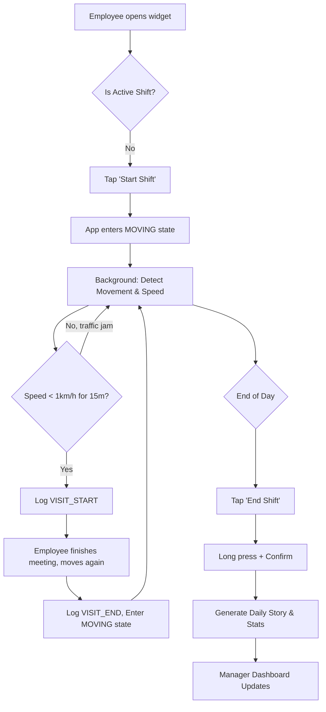

Here is the Product Requirements Document (PRD) for **MyVisit**. This document is structured to align your vision with actionable development steps for the MVP.

---

# 📄 Product Requirements Document: MyVisit
**Version:** 1.0 (MVP)  
**Date:** October 2023  
**Status:** Approved for Development  

## 1. Product Overview
**MyVisit** is a Strava-like work coordination and attendance app for field force teams (sales, field engineers, delivery). It shifts the paradigm of "presence" from desk time to "productive movement." The app intelligently tracks movement and stops, categorizes them based on employee profiles, and provides beautiful, data-rich visualizations and statistics for both the employee and management.

## 2. Target Audience & Personas
1.  **The Anchor (Sales/Field Engineer):** Productivity = Dwell Time. Moving is transit; stopping (>15 mins, excluding traffic/lunch) = Work.
2.  **The Transit (Driver/Delivery):** Productivity = Movement. Stopping = Unproductive/Waiting.
3.  **The Manager:** Needs real-time visibility of field staff, visit verifications, and historical route/statistics for payroll and territory optimization.

## 3. Goals & Non-Goals (MVP)
**Goals:**
*   Build a reliable, battery-efficient background tracking engine (State Machine).
*   Implement dual profiles (Anchor vs. Transit) with automatic state detection.
*   Provide a Strava-like UI for daily route playback and stop visualization.
*   Deliver core statistics (distance, speed, visit duration, travel-to-work ratio).
*   Enforce strict shift rules (One shift/day, long-press to end, auto-pause/resume).

**Non-Goals (Out of Scope for MVP):**
*   Advanced ML for traffic vs. work visit detection (use basic geolocation/speed rules + manual override for MVP).
*   CRM integrations (Salesforce, HubSpot).
*   Team radar ("who is nearby").
*   Gamification/Badges.

## 4. Core Features & Requirements

### 4.1. Shift Management & State Machine
*   **Single Shift Rule:** One active shift per day per user.
*   **Start Shift:** Initiated from the mobile widget or app. Requires 1 tap.
*   **Auto-Pause/Resume Logic:**
    *   *Anchor Profile:* If speed < 1 km/h for >15 mins (and not on a highway), log as "Visit". If moving > 5 km/h, log as "Transit".
    *   *Transit Profile:* If speed < 1 km/h for >5 mins, log as "Waiting". If moving, log as "Active Work".
*   **Manual Override:** A "Force Check-in" button on the widget to instantly trigger a Visit (for <15 min meetings).
*   **End Shift:** Long-press the widget/app button + confirmation modal. If a user tries to start a new shift, warn them the previous shift will be invalidated.

### 4.2. Tracking & Intelligent Detection
*   **OS-Level Activity Recognition:** Use native APIs (Android Activity Recognition, iOS Core Motion) to detect Walking, Running, Cycling, or Driving *without* turning on GPS to save battery.
*   **Significant Location Changes (SLC):** Wake the app only when cell towers change significantly (~500m).
*   **Geocoding & Places:** Auto-reverse-geocode stops to street addresses. Query basic place types (e.g., restaurant = lunch, commercial building = work).
*   **Battery Optimization:** Batch GPS pings locally on the device; sync to Convex backend every 1-2 minutes over cellular/Wi-Fi.

### 4.3. Visualization & UI (The "Strava" Experience)
*   **Daily Map View:**
    *   Polyline of the route (Mapbox).
    *   Stop Nodes represented as circles. Size = duration. Color = type (Work, Traffic, Lunch).
    *   3D Route Playback (animated dot moving along the route).
*   **Timeline View (Equalizer):**
    *   Color-coded horizontal bars representing states (e.g., Green = Driving, Blue = Visit, Grey = Lunch) with timestamps.
*   **Media:** Users can attach photos to Stop Nodes (e.g., installed equipment, storefront).

### 4.4. Statistics & Data
*   **Metrics:** Total distance, shortest/longest/average distance, moving speed (slowest/fastest/average), visit duration, visit count.
*   **Travel-to-Work Ratio:** % of day in transit vs. % in visits.
*   **Location Insights:** New places vs. revisited places vs. frequent visits.
*   **Cadence:** Daily, Weekly, Monthly aggregations.

### 4.5. Manager Dashboard
*   A web portal (React/Next.js) viewing real-time employee states.
*   Live list of active shifts with current state ("In Transit", "At Client X - 15 mins").
*   Map showing active field workers.
*   End-of-day sync: Once an employee ends their shift, they drop off the live radar (respecting off-the-clock privacy).

## 5. Technical Architecture

### 5.1. Frontend (Mobile)
*   **Framework:** React Native (cross-platform, but with native modules for background tasks).
*   **Background Tracking:** `react-native-background-geolocation` (or custom native modules using Android Fused Location Provider & iOS SLC).
*   **Maps:** Mapbox GL (custom styling, 3D camera, route playback).
*   **Widget:** Native Android/iOS home screen widget for Start/Stop/End.

### 5.2. Backend & Database
*   **Primary Backend:** Convex.dev.
    *   **Real-time Sync:** Manager dashboard gets instant updates via Convex's reactive queries.
    *   **Backend Logic:** Convex TypeScript functions handle visit detection rules, state transitions, and statistics calculations.
    *   **Data Model:** Document-based. A `shifts` table containing an array of `events` (GPS points, state changes).
*   **Client Sync Strategy:** The RN app buffers GPS points locally. Every 60-120 seconds, it batches a single mutation to Convex to update the shift document.

### 5.3. Future Considerations
*   **Supabase (PostGIS):** To be added in Phase 2 for heavy geospatial analytics (e.g., "Calculate total miles driven in Q3" without overloading Convex).
*   **Cloudflare D1:** Archival storage for shifts older than 90 days.

## 6. UX Flow (Employee Journey)

## 7. Success Metrics (MVP)
1.  **Battery Drain:** < 15% battery drain over an 8-hour shift with background tracking active.
2.  **Background Reliability:** App is not killed by the OS for 95% of active shifts.
3.  **Data Accuracy:** 90% of stops >15 minutes are correctly logged as visits without manual intervention.
4.  **Manager Adoption:** Managers can see real-time status of 100% of field workers during active shifts.

## 8. Development Phasing

*   **Phase 1 (Weeks 1-4):** Core Engine. RN setup, Convex schema, background location state machine, basic UI (Start/Stop/Status).
*   **Phase 2 (Weeks 5-8):** UI & Maps. Mapbox integration, route polylines, stop nodes, timeline view, Convex real-time sync to manager dashboard.
*   **Phase 3 (Weeks 9-12):** Stats & Polish. Route playback animation, statistics calculations, photo attachments, widget implementation, beta testing.

---

### Next Steps for Development:
1.  **Set up Convex Project:** Initialize the schema based on the `shifts` and `employees` tables.
2.  **Initialize React Native:** Scaffold the app and install `react-native-background-geolocation`.
3.  **Build the State Machine:** Write the TypeScript logic in Convex to handle the `MOVING -> STOPPED -> VISIT` transitions based on incoming batched GPS data.
